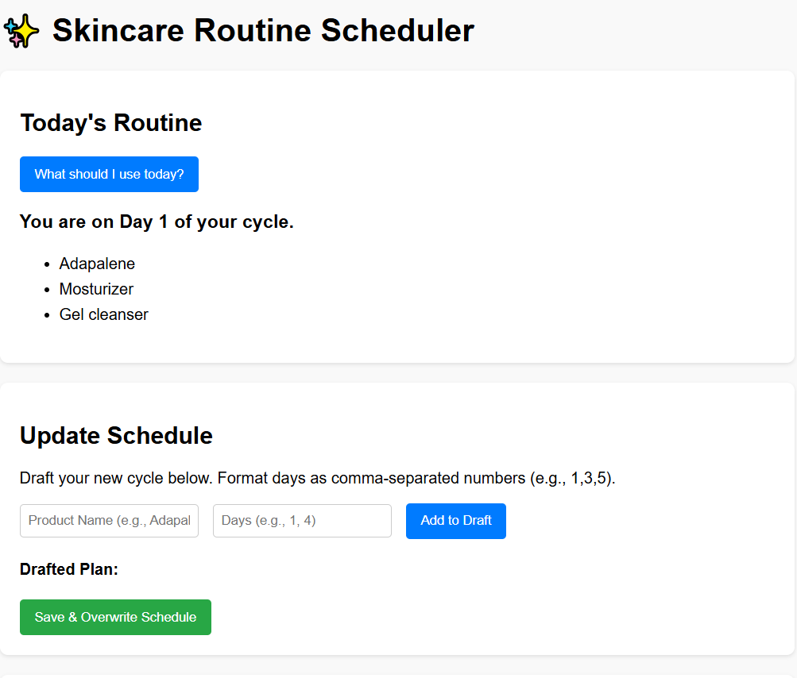
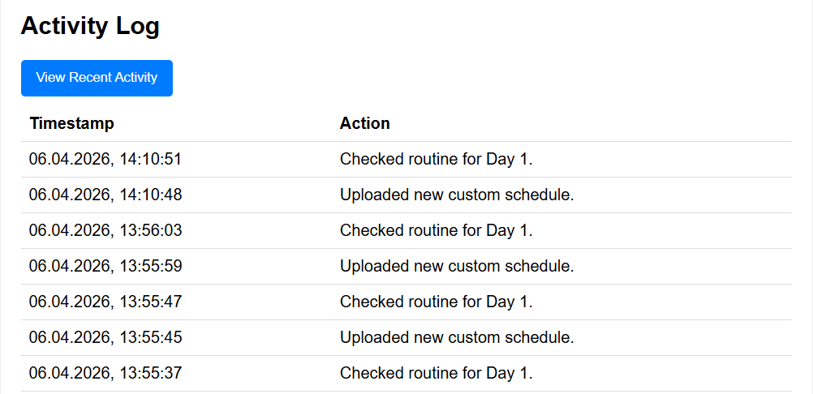

# Skincare Routine Scheduler

A smart skincare scheduler that tracks your active ingredient usage to prevent skin barrier damage.

## Demo

## Product context

**End users:** Individuals managing multi-step skincare routines.

**Problem that your product solves for end users:** Accidental over-application of strong active ingredients, which can compromise the skin barrier.

**Your solution:** An automated database-backed scheduling system that tracks your cycle and enforces alternating days for harsh actives and recovery products.

## Features

**Implemented features:**
- Custom schedule generation and cycle mapping
- Daily routine calculation based on previous usage
- Command history and timestamp logging
- Dockerized deployment.

**Not yet implemented features:**
- Multi-user authentication and individual accounts
- Downloadable PDF/ICS schedule exports

## Usage

1. Use the "Update Schedule" section to input product names and assign them to specific cycle days (e.g., Days: 1, 3).
2. Click "Save & Overwrite Schedule" to finalize your cycle.
3. Click "What should I use today?" on the main dashboard to view your current daily requirements.

## Deployment

**OS:** Ubuntu 24.04

**What should be installed on the VM:** Docker, Docker Compose

**Step-by-step deployment instructions:**
1. Clone the repository: `git clone https://github.com/b3ss0n/se-toolkit-hackathon.git`
2. Navigate into the directory: `cd se-toolkit-hackathon`
3. Build and run the containers: `docker compose up --build -d`
4. Access the application via web browser at: `http://<your-vm-ip>:8000`
